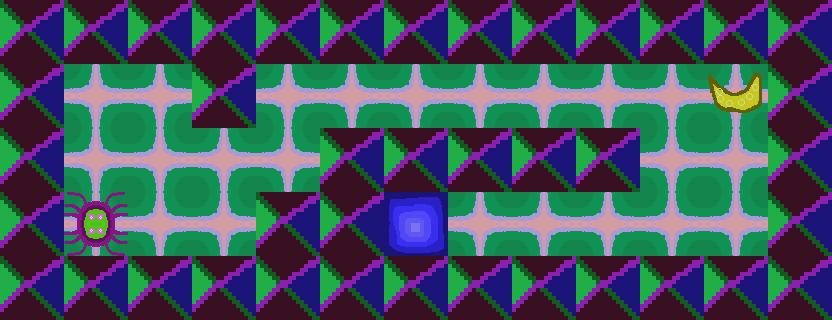

# 42-solong

le dauphin et la daulphine

## Game

### Assets





## Doc 

[Video](https://www.youtube.com/watch?v=P1kvQthJw_I&list=PL2xrTwdohaTar51BfB5QA44b_nwWy_mg1&index=1)
about how work raytracing...

classique
[documentation](https://harm-smits.github.io/42docs/libs/minilibx)

other [site](https://gontjarow.github.io/MiniLibX/)

example of [programm](https://github.com/qst0/ft_libgfx#minilibx)

If you are a linux user... Follow this 
[instruction](https://harm-smits.github.io/42docs/libs/minilibx)

Video on the intranet
* [introduction](https://elearning.intra.42.fr/notions/minilibx/subnotions/mlx-introduction/videos/introduction-to-minilibx#)
* [events](https://elearning.intra.42.fr/notions/minilibx/subnotions/mlx-events/videos/minilibx-events)


## Linux user

```
~:$ sudo apt-get install gcc make xorg libxext-dev libbsd-dev 
~:$ git clone https://github.com/42Paris/minilibx-linux
~:$ cd minilibx-linux
~:$ sudo ./configure
```
