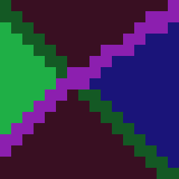
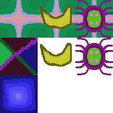
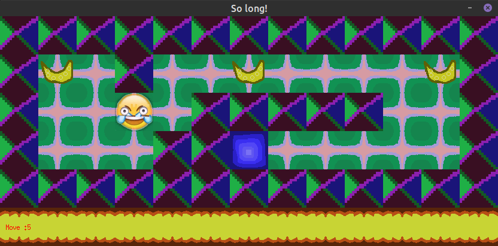

# 42-solong

le dauphin et la daulphine

## Game

### Assets

I use [Pixelorama](https://github.com/Orama-Interactive/Pixelorama)
for creating my sprites.
change file type, png to xpm.

For make a transparency, find the backgound color and set to ```none```






### Map

```
0 for an empty space
1 for a wall
C for a collectible
E for map exit
P for the player
1111111111111
10010000000C1
1000011111001
1P0011E000001
1111111111111
```



##	program

### main

### create map

* malloc map
* file in map
* check map errors
	* number player = 1
	* number exit >= 1
	* number collectible >= 1
	* wall all around
		* yes free map
		* no, continue

### information about map

* player location (x;y)
* number of collectible
*

## Doc 

[Video](https://www.youtube.com/watch?v=P1kvQthJw_I&list=PL2xrTwdohaTar51BfB5QA44b_nwWy_mg1&index=1)
about how work raytracing...

classique
[documentation](https://harm-smits.github.io/42docs/libs/minilibx)

other [site](https://gontjarow.github.io/MiniLibX/)

example of [programm](https://github.com/qst0/ft_libgfx#minilibx)

If you are a linux user... Follow this 
[instruction](https://harm-smits.github.io/42docs/libs/minilibx)

Video on the intranet
* [introduction](https://elearning.intra.42.fr/notions/minilibx/subnotions/mlx-introduction/videos/introduction-to-minilibx#)
* [events](https://elearning.intra.42.fr/notions/minilibx/subnotions/mlx-events/videos/minilibx-events)


## Linux user

```
~:$ sudo apt-get install xorg libxext-dev zlib1g-dev gcc make xorg libxext-dev libbsd-dev 
~:$ git clone https://github.com/42Paris/minilibx-linux
~:$ cd minilibx-linux
~:$ sudo ./configure
```
